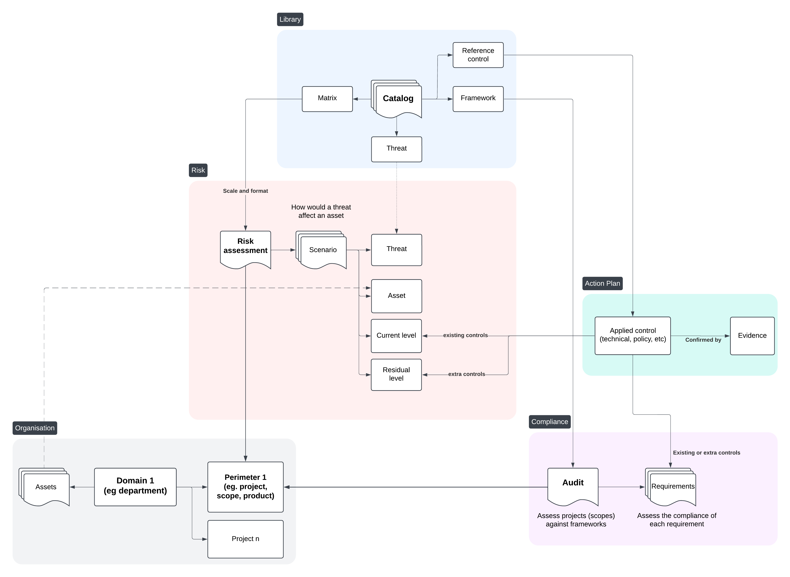
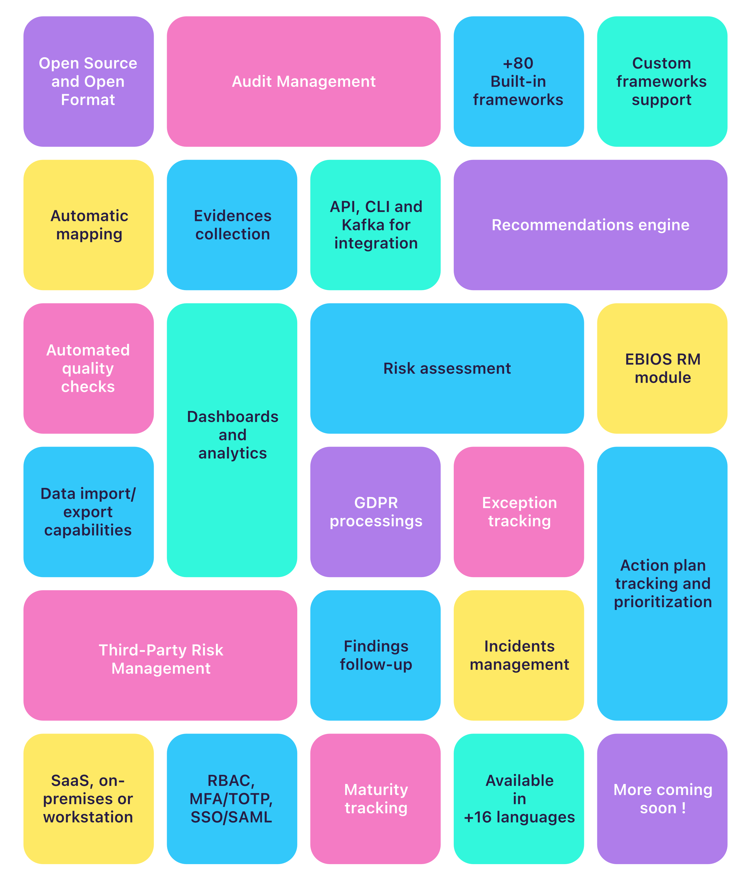
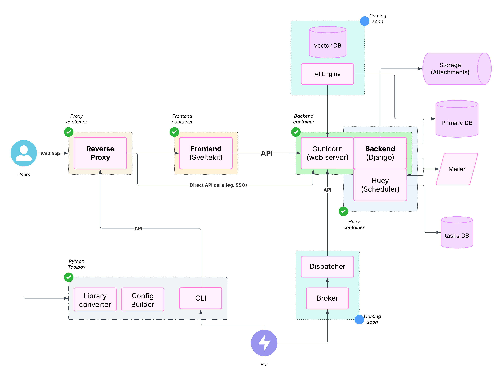

<p align="center">
  
</p>

<p align="center">
  <strong>CISO Assistant Mitra Keluarga - Production Environment</strong>
</p>

<p align="center">
  <a href="https://gracia.mitrakeluarga.com:8443">🌐 Production Site</a>
  ·
  <a href="https://dev-gracia.mitrakeluarga.com:8443">🌐 Developer Site</a>
  ·
  <a href="mailto:it.security@mitrakeluarga.com">📧 IT Security</a>
  ·
  <a href="#status">📊 Status</a>
</p>

## Status Sistem


### Production Environment Details
- **URL**: https://gracia.mitrakeluarga.com:8443
- **Status**: ✅ Online
- **Database**: PostgreSQL
- **Email Service**: ✅ Configured
- **SSL/TLS**: ✅ Enabled
- **Backup**: ✅ Automated
- **Monitoring**: ✅ Active

## Workflow dan Prosedur Penggunaan 📋

### 1. Akses Sistem
- Buka browser dan akses [https://agilciso.mitrakeluarga.com:8443](https://agilciso.mitrakeluarga.com:8443)
- Login menggunakan kredensial yang telah diberikan oleh IT Security
- Untuk development, gunakan [https://dev-gracia.mitrakeluarga.com:8443](https://dev-gracia.mitrakeluarga.com:8443)

### 2. Dashboard Utama
- Setelah login, Anda akan melihat dashboard dengan overview status compliance
- Navigasi menu tersedia di sidebar kiri
- Status assessment dan risk scenario ditampilkan dalam bentuk grafik

### 3. Manajemen Framework
- Pilih **Frameworks** dari menu untuk melihat framework compliance yang tersedia
- Klik framework yang ingin digunakan (ISO 27001, NIST, dll)
- Buat assessment baru dengan klik **Create Assessment**

### 4. Risk Assessment
- Akses menu **Risk Assessments** untuk membuat penilaian risiko
- Tentukan scope dan perimeter assessment
- Identifikasi aset, ancaman, dan kerentanan
- Evaluasi tingkat risiko menggunakan risk matrix

### 5. Compliance Assessment
- Buka **Compliance Assessments** untuk audit compliance
- Pilih framework yang sesuai dengan kebutuhan organisasi
- Isi requirement assessment sesuai dengan implementasi kontrol
- Upload evidence dan dokumentasi pendukung

### 6. Applied Controls
- Kelola kontrol keamanan di menu **Applied Controls**
- Assign owner untuk setiap kontrol
- Set timeline dan status implementasi
- Track progress remediation

### 7. Reporting
- Generate laporan dari menu **Reports**
- Pilih jenis laporan: Executive Summary, Detailed Assessment, atau Custom
- Export dalam format PDF atau Excel
- Schedule automated reporting jika diperlukan

### 8. User Management (Admin)
- Admin dapat mengelola user di menu **Users**
- Assign role dan permission sesuai kebutuhan
- Manage domain access dan folder permissions

### 9. Backup dan Maintenance
- Sistem melakukan backup otomatis setiap hari
- Maintenance window dijadwalkan setiap minggu
- Notifikasi akan dikirim via email untuk scheduled maintenance

### 10. Support dan Bantuan
- Untuk bantuan teknis, hubungi [it.security@mitrakeluarga.com](mailto:it.security@mitrakeluarga.com)
- Dokumentasi lengkap tersedia di sistem
- Training session dapat dijadwalkan sesuai kebutuhan

CISO Assistant menawarkan perspektif baru dalam pengelolaan Cybersecurity dan praktik **GRC** (Governance, Risk, and Compliance):

- Dirancang sebagai pusat penghubung untuk menghubungkan berbagai konsep cybersecurity dengan smart linking antar objek,
- Dibangun sebagai tool **multi-paradigm** yang dapat beradaptasi dengan berbagai latar belakang, metodologi, dan ekspektasi,
- Secara eksplisit **memisahkan** compliance dari cybersecurity controls, memungkinkan penggunaan kembali di seluruh platform,
- Mendorong **penggunaan kembali** dan interkoneksi daripada pekerjaan yang berulang,
- Dikembangkan dengan pendekatan **API-first** untuk mendukung interaksi UI dan **automation** eksternal,
- Dilengkapi dengan berbagai standar built-in, security controls, dan threat libraries,
- Menawarkan **format terbuka** untuk menyesuaikan dan menggunakan kembali objek dan frameworks Anda sendiri,
- Menyertakan **risk assessment** dan **remediation tracking** workflows built-in,
- Mendukung custom frameworks melalui syntax sederhana dan tooling yang fleksibel,
- Menyediakan kemampuan **import/export** yang kaya melalui berbagai channel dan format (UI, CLI, Kafka, reports, dll.).

Visi kami adalah menciptakan **solusi lengkap** untuk pengelolaan cybersecurity—memodernisasi GRC melalui **penyederhanaan** dan **interoperabilitas**.

Sebagai praktisi yang bekerja dengan profesional cybersecurity dan IT, kami menghadapi masalah yang sama: fragmentasi tool, duplikasi data, dan kurangnya solusi yang intuitif dan terintegrasi. CISO Assistant lahir dari pembelajaran tersebut, dan kami membangun komunitas berdasarkan prinsip **pragmatis** dan **akal sehat**.

We’re constantly evolving with input from users and customers. Like an octopus 🐙, CISO Assistant keeps growing extra arms—bringing clarity, automation, and productivity to cybersecurity teams while reducing the effort of data input and output.

---

## Core Concepts

Here’s a snapshot of the fundamental building blocks in CISO Assistant:



For full details, check the [data model documentation](documentation/architecture/data-model.md).

---

## Features

Explore the full range of features and capabilities:



CISO Assistant is developed and maintained by [Intuitem](https://intuitem.com/), a company specialized in Cybersecurity, Cloud, and Data/AI.

---

## Decoupling Concept

At the heart of CISO Assistant lies the **decoupling principle**, which enables powerful use cases and major time savings:

- Reuse past assessments across scopes or frameworks,
- Evaluate a single scope against multiple frameworks simultaneously,
- Let CISO Assistant handle reporting and consistency checks so you can focus on remediation,
- Separate control implementation from compliance tracking.

Here is an illustration of the **decoupling** principle and its advantages:

<https://github.com/user-attachments/assets/87bd4497-5cc2-4221-aeff-396f6b6ebe62>

## System architecture



## Memulai Cepat 🚀

> [!TIP]
> Cara termudah untuk memulai adalah melalui akses ke environment production di [https://gracia.mitrakeluarga.com:8443](https://gracia.mitrakeluarga.com:8443) atau development di [https://dev-gracia.mitrakeluarga.com:8443](https://dev-gracia.mitrakeluarga.com:8443).

Alternatif lain, setelah Anda menginstall _Docker_ dan _Docker-compose_ di workstation atau server Anda:

Clone repository:

```
git clone --single-branch -b master https://gitlab.mitrakeluarga.com/itsecurity/ciso-assistant.git
```

dan jalankan script starter:

```sh
./docker-compose.sh
```

Jika Anda mencari opsi instalasi lain untuk self-hosting, periksa [config builder](./config/) dan [dokumentasi](https://intuitem.gitbook.io/ciso-assistant).

> [!NOTE]
> Script docker-compose menggunakan Docker images yang sudah dibangun sebelumnya dan mendukung sebagian besar arsitektur hardware standar.
> Jika Anda menggunakan **Windows**, pastikan [WSL](https://learn.microsoft.com/en-us/windows/wsl/install) sudah terinstall dan jalankan script dalam command line WSL. Ini akan menggunakan Docker Desktop secara otomatis.

File docker compose dapat disesuaikan untuk menambahkan parameter tambahan sesuai setup Anda (misalnya pengaturan Mailer).

> [!WARNING]
> Jika Anda mendapat peringatan atau error tentang platform image yang tidak cocok dengan platform host, laporkan masalah tersebut dengan detail dan kami akan menambahkannya segera. Anda juga dapat menggunakan `docker-compose-build.sh` sebagai gantinya (lihat di bawah) untuk membangun sesuai arsitektur spesifik Anda.

> [!CAUTION]
> Jangan gunakan kode branch `main` secara langsung untuk production karena ini adalah merge upstream dan dapat memiliki perubahan yang merusak selama development kami. Gunakan `tags` untuk versi stabil atau prebuilt images.

## End-user Documentation

Check out the online documentation on <https://intuitem.gitbook.io/ciso-assistant>.

## Supported frameworks 🐙

1. ISO 27001:2022 🌐
2. NIST Cyber Security Framework (CSF) v1.1 🇺🇸
3. NIST Cyber Security Framework (CSF) v2.0 🇺🇸
4. NIS2 🇪🇺
5. SOC2 🇺🇸
6. PCI DSS 4.0 💳
7. CMMC v2 🇺🇸
8. PSPF 🇦🇺
9. General Data Protection Regulation (GDPR): Full text and checklist from GDPR.EU 🇪🇺
10. Essential Eight 🇦🇺
11. NYDFS 500 with 2023-11 amendments 🇺🇸
12. DORA (Act, RTS, ITS and GL) 🇪🇺
13. NIST AI Risk Management Framework 🇺🇸🤖
14. NIST SP 800-53 rev5 🇺🇸
15. France LPM/OIV rules 🇫🇷
16. CCB CyberFundamentals Framework 🇧🇪
17. NIST SP-800-66 (HIPAA) 🏥
18. HDS/HDH 🇫🇷
19. OWASP Application Security Verification Standard (ASVS) 🐝🖥️
20. RGS v2.0 🇫🇷
21. AirCyber ✈️🌐
22. Cyber Resilience Act (CRA) 🇪🇺
23. TIBER-EU 🇪🇺
24. NIST Privacy Framework 🇺🇸
25. TISAX (VDA ISA) v5.1 and v6.0 🚘
26. ANSSI hygiene guide 🇫🇷
27. Essential Cybersecurity Controls (ECC) 🇸🇦
28. CIS Controls v8\* 🌐
29. CSA CCM (Cloud Controls Matrix)\* ☁️
30. FADP (Federal Act on Data Protection) 🇨🇭
31. NIST SP 800-171 rev2 (2021) 🇺🇸
32. ANSSI : recommandations de sécurité pour un système d'IA générative 🇫🇷🤖
33. NIST SP 800-218: Secure Software Development Framework (SSDF) 🖥️
34. GSA FedRAMP rev5 ☁️🇺🇸
35. Cadre Conformité Cyber France (3CF) v1 (2021) ✈️🇫🇷
36. ANSSI : SecNumCloud ☁️🇫🇷
37. Cadre Conformité Cyber France (3CF) v2 (2024) ✈️🇫🇷
38. ANSSI : outil d’autoévaluation de gestion de crise cyber 💥🇫🇷
39. BSI: IT-Grundschutz-Kompendium 🇩🇪
40. NIST SP 800-171 rev3 (2024) 🇺🇸
41. ENISA: 5G Security Controls Matrix 🇪🇺
42. OWASP Mobile Application Security Verification Standard (MASVS) 🐝📱
43. Agile Security Framework (ASF) - baseline - by intuitem 🤗
44. ISO 27001:2013 🌐 (For legacy and migration)
45. EU AI Act 🇪🇺🤖
46. FBI CJIS 🇺🇸👮
47. Operational Technology Cybersecurity Controls (OTCC) 🇸🇦
48. Secure Controls Framework (SCF) 🇺🇸🌐
49. NCSC Cyber Assessment Framework (CAF) 🇬🇧
50. California Consumer Privacy Act (CCPA) 🇺🇸
51. California Consumer Privacy Act Regulations 🇺🇸
52. NCSC Cyber Essentials 🇬🇧
53. Directive Nationale de la Sécurité des Systèmes d'Information (DNSSI) Maroc 🇲🇦
54. Part-IS ✈️🇪🇺
55. ENS Esquema Nacional de seguridad 🇪🇸
56. Korea ISA ISMS-P 🇰🇷
57. Swiss ICT minimum standard 🇨🇭
58. Adobe Common Controls Framework (CCF) 🌐
59. BSI Cloud Computing Compliance Criteria Catalogue (C5) 🇩🇪
60. Référentiel d’Audit de la Sécurité des Systèmes d’Information, ANCS Tunisie 🇹🇳
61. ECB Cyber resilience oversight expectations for financial market infrastructures 🇪🇺
62. Mindeststandard-des-BSI-zur-Nutzung-externer-Cloud-Dienste (Version 2.1) 🇩🇪
63. Formulaire d'évaluation de la maturité - niveau fondamental (DGA) 🇫🇷
64. NIS2 technical and methodological requirements 2024/2690 🇪🇺
65. Saudi Arabian Monetary Authority (SAMA) Cybersecurity Framework 🇸🇦
66. Guide de sécurité des données (CNIL) 🇫🇷
67. International Traffic in Arms Regulations (ITAR) 🇺🇸
68. Federal Trade Commission (FTC) Standards for Safeguarding Customer Information 🇺🇸
69. OWASP's checklist for LLM governance and security 🌐
70. Recommandations pour les architectures des systèmes d’information sensibles ou à diffusion restreinte (ANSSI) 🇫🇷
71. CIS benchmark for Kubernetes v1.10 🌐
72. De tekniske minimumskrav for statslige myndigheder 🇩🇰
73. Google SAIF framework 🤖
74. Recommandations relatives à l'administration sécurisée des SI (ANSSI) 🇫🇷
75. Prudential Standard CPS 230 - Operational Risk Management (APRA) 🇦🇺
76. Prudential Standard CPS 234 - Information Security (APRA) 🇦🇺

### Community contributions

1. PGSSI-S (Politique Générale de Sécurité des Systèmes d'Information de Santé) 🇫🇷
2. ANSSI : Recommandations de configuration d'un système GNU/Linux 🇫🇷
3. PSSI-MCAS (Politique de sécurité des systèmes d’information pour les ministères chargés des affaires sociales) 🇫🇷
4. ANSSI : Recommandations pour la protection des systèmes d'information essentiels 🇫🇷
5. ANSSI : Recommandations de sécurité pour l'architecture d'un système de journalisation 🇫🇷
6. ANSSI : Recommandations de sécurité relatives à TLS 🇫🇷
7. New Zealand Information Security Manual (NZISM) 🇳🇿
8. Clausier de sécurité numérique du Club RSSI Santé 🇫🇷
9. Référentiel National de Sécurité de l’Information (RNSI), MPT Algérie 🇩🇿
10. Misure minime di sicurezza ICT per le pubbliche amministrazioni, AGID Italia 🇮🇹
11. Framework Nazionale CyberSecurity v2, FNCS Italia 🇮🇹
12. Framework Nazionale per la Cybersecurity e la Data Protection, ACN Italia 🇮🇹
13. PSSIE du Bénin, ANSSI Bénin 🇧🇯
14. IGI 1300 - Liste des exigences pour la mise en oeuvre d'un SI classifié (ANSSI) 🇫🇷

<br/>

> [!NOTE]
> Frameworks with `*` require an extra manual step of getting the latest Excel sheet through their website as their license prevent direct usage.

<br/>

Checkout the [library](/backend/library/libraries/) and [tools](/tools/) for the Domain Specific Language used and how you can define your own.

### Coming soon

- Indonesia PDP 🇮🇩
- VCS framework from ENX
- OWASP SAMM
- COBAC R-2024/01
- ICO Data protection self-assessment 🇬🇧
- NIST 800-82
- ASD ISM 🇦🇺
- Baseline informatiebeveiliging Overheid (BIO) 🇳🇱

- and much more: just ask on [Discord](https://discord.gg/qvkaMdQ8da). If it's an open standard, we'll do it for you, _free of charge_ 😉

## Add your own library

A library can be a framework, a catalog of threats or reference controls, and even a custom risk matrix.

Take a look at the `tools` directory and its [dedicated README](tools/README.md). The `convert_library.py` script will help you create your library from a simple Excel file. Once you have structured your items in that format, just run the script and use the resulting yaml file.

You can also find some specific converters in the tools directory (e.g. for CIS or CCM Controls).

There is also a tool to facilitate the creation of mappings, called `prepare_mapping.py` that will create an Excel file based on two framework libraries in yaml. Once properly filled, this Excel file can be processed by the `convert_library.py` tool to get the resulting mapping library.

## Community

Join our [open Discord community](https://discord.gg/qvkaMdQ8da) to interact with the team and other GRC experts.

## Testing the cloud version

> The fastest and easiest way to get started is through the [free trial of cloud instance available here](https://intuitem.com/trial).

## Menjalankan Secara Lokal 🚀

Untuk menjalankan CISO Assistant secara lokal dengan cara yang mudah, Anda dapat menggunakan Docker compose.

0. Update docker

Pastikan Anda memiliki versi docker yang terbaru (>= 27.0).

1. Clone repository

```sh
git clone --single-branch -b master https://gitlab.mitrakeluarga.com/itsecurity/ciso-assistant.git
cd ciso-assistant
```

2. Jalankan script docker-compose untuk prebuilt images:

```sh
./docker-compose.sh
```

_Alternatif lain_, Anda dapat menggunakan varian ini untuk membangun docker images sesuai arsitektur spesifik Anda:

```sh
./docker-compose-build.sh
```

Ketika diminta, masukkan email dan password untuk superuser Anda.

Anda kemudian dapat mengakses CISO Assistant menggunakan web browser di [https://localhost:8443/](https://localhost:8443/)

Untuk eksekusi selanjutnya, gunakan "docker compose up" secara langsung.

## Menyiapkan CISO Assistant untuk Development

### Persyaratan

- Python 3.12+
- pip 20.3+
- poetry 2.0+
- node 22+
- npm 10.2+
- pnpm 9.0+
- yaml-cpp (brew install yaml-cpp libyaml atau apt install libyaml-cpp-dev)

### Running the backend

1. Clone repository.

```sh
git clone git@gitlab.mitrakeluarga.com:itsecurity/ciso-assistant.git
cd ciso-assistant
```

2. Create a file in the parent folder (e.g. ../myvars) and store your environment variables within it by copying and modifying the following code and replace `"<XXX>"` by your private values. Take care not to commit this file in your git repo.

**Mandatory variables**

All variables in the backend have handy default values.

**Recommended variables**

```sh
export DJANGO_DEBUG=True

# URL untuk development environment
export CISO_ASSISTANT_URL=https://dev-gracia.mitrakeluarga.com:8443

# Konfigurasi email production Mitra Keluarga
export EMAIL_HOST=smtp.gmail.com
export EMAIL_PORT=587
export EMAIL_HOST_USER=it.security@mitrakeluarga.com
export EMAIL_HOST_PASSWORD=<your_email_password>
export EMAIL_USE_TLS=True
export DEFAULT_FROM_EMAIL=it.security@mitrakeluarga.com
```

**Other variables**

```sh
# CISO Assistant will use SQLite by default, but you can setup PostgreSQL by declaring these variables
export POSTGRES_NAME=ciso-assistant
export POSTGRES_USER=ciso-assistantuser
export POSTGRES_PASSWORD=<XXX>
export POSTGRES_PASSWORD_FILE=<XXX>  # alternative way to specify password
export DB_HOST=localhost
export DB_PORT=5432  # optional, default value is 5432

# CISO Assistant will use filesystem storage backend bu default.
# You can use a S3 Bucket by declaring these variables
# The S3 bucket must be created before starting CISO Assistant
export USE_S3=True
export AWS_ACCESS_KEY_ID=<XXX>
export AWS_SECRET_ACCESS_KEY=<XXX>
export AWS_STORAGE_BUCKET_NAME=<your-bucket-name>
export AWS_S3_ENDPOINT_URL=<your-bucket-endpoint>

# Add a second backup mailer (will be deprecated, not recommended anymore)
export EMAIL_HOST_RESCUE=<XXX>
export EMAIL_PORT_RESCUE=587
export EMAIL_HOST_USER_RESCUE=<XXX>
export EMAIL_HOST_PASSWORD_RESCUE=<XXX>
export EMAIL_USE_TLS_RESCUE=True

# You can define the email of the first superuser, useful for automation. A mail is sent to the superuser for password initialization
export CISO_SUPERUSER_EMAIL=<XXX>

# By default, Django secret key is generated randomly at each start of CISO Assistant. This is convenient for quick test,
# but not recommended for production, as it can break the sessions (see
# this [topic](https://stackoverflow.com/questions/15170637/effects-of-changing-djangos-secret-key) for more information).
# To set a fixed secret key, use the environment variable DJANGO_SECRET_KEY.
export DJANGO_SECRET_KEY=...

# Logging configuration
export LOG_LEVEL=INFO # optional, default value is INFO. Available options: DEBUG, INFO, WARNING, ERROR, CRITICAL
export LOG_FORMAT=plain # optional, default value is plain. Available options: json, plain

# Authentication options
export AUTH_TOKEN_TTL=3600 # optional, default value is 3600 seconds (60 minutes). It defines the time to live of the authentication token
export AUTH_TOKEN_AUTO_REFRESH=True # optional, default value is True. It defines if the token TTL should be refreshed automatically after each request authenticated with the token
export AUTH_TOKEN_AUTO_REFRESH_TTL=36000 # optional, default value is 36000 seconds (10 hours). It defines the time to live of the authentication token after auto refresh. You can disable it by setting it to 0.
```

3. Install poetry

Visit the poetry website for instructions: <https://python-poetry.org/docs/#installation>

4. Install required dependencies.

```sh
poetry install
```

5. Recommended: Install the pre-commit hooks.

```sh
pre-commit install
```

6. If you want to setup Postgres:

- Launch one of these commands to enter in Postgres:
  - `psql as superadmin`
  - `sudo su postgres`
  - `psql`
- Create the database "ciso-assistant"
  - `create database ciso-assistant;`
- Create user "ciso-assistantuser" and grant it access
  - `create user ciso-assistantuser with password '<POSTGRES_PASSWORD>';`
  - `grant all privileges on database ciso-assistant to ciso-assistantuser;`

7. If you want to setup s3 bucket:

- Choose your s3 provider or try s3 feature with miniO with this command:
  - `docker run -p 9000:9000 -p 9001:9001 -e "MINIO_ROOT_USER=XXX" -e "MINIO_ROOT_PASSWORD=XXX" quay.io/minio/minio server /data --console-address ":9001"`
- You can now check your bucket on http://localhost:9001
  - Fill the login with the credentials you filled on the docker run env variables
- Export in the backend directory all the env variables asked about S3
  - You can see the list above in the recommanded variables

8. Apply migrations.

```sh
poetry run python manage.py migrate
```

9. Create a Django superuser, that will be CISO Assistant administrator.

> If you have set a mailer and CISO_SUPERUSER_EMAIL variable, there's no need to create a Django superuser with `createsuperuser`, as it will be created automatically on first start. You should receive an email with a link to setup your password.

```sh
poetry run python manage.py createsuperuser
```

10. Run development server.

```sh
poetry run python manage.py runserver
```

11. for Huey (tasks runner)

- prepare a mailer for testing.
- run `python manage.py run_huey -w 2 -k process` or equivalent in a separate shell.
- you can use `MAIL_DEBUG` to have mail on the console for easier debug

### Running the frontend

1. cd into the frontend directory

```shell
cd frontend
```

2. Install dependencies

```bash
npm install -g pnpm
pnpm install
```

3. Start a development server (make sure that the django app is running)

```bash
pnpm run dev
```

4. Reach the frontend on <http://localhost:5173>

> [!NOTE]
> Safari will not properly work in this setup, as it requires https for secure cookies. The simplest solution is to use Chrome or Firefox. An alternative is to use a caddy proxy. Please see the [readme file](frontend/README.md) in frontend directory for more information on this.

5. Environment variables

All variables in the frontend have handy default values.

If you move the frontend on another host, you should set the following variable: PUBLIC_BACKEND_API_URL. Its default value is <http://localhost:8000/api>.

The PUBLIC_BACKEND_API_EXPOSED_URL is necessary for proper functioning of the SSO. It points to the URL of the API as seen from the browser. It should be equal to the concatenation of CISO_ASSISTANT_URL (in the backend) with "/api".

When you launch "node server" instead of "pnpm run dev", you need to set the ORIGIN variable to the same value as CISO_ASSISTANT_URL in the backend (e.g. <http://localhost:3000>).

### Managing migrations

The migrations are tracked by version control, <https://docs.djangoproject.com/en/4.2/topics/migrations/#version-control>

For the first version of the product, it is recommended to start from a clean migration.

Note: to clean existing migrations, type:

```sh
find . -path "*/migrations/*.py" -not -name "__init__.py" -delete
find . -path "*/migrations/*.pyc"  -delete
```

After a change (or a clean), it is necessary to re-generate migration files:

```sh
poetry run python manage.py makemigrations
poetry run python manage.py migrate
```

These migration files should be tracked by version control.

### Test suite

To run API tests on the backend, simply type "poetry run pytest" in a shell in the backend folder.

To run functional tests on the frontend, do the following actions:

- in the frontend folder, launch the following command:

```shell
tests/e2e-tests.sh
```

The goal of the test harness is to prevent any regression, i.e. all the tests shall be successful, both for backend and frontend.

## API and Swagger

- The API is available only on dev mode. To get that, you need to switch on the backend, for instance, `export DJANGO_DEBUG=True`
- The API documentation will be available on `<backend_endpoint>/api/schema/swagger/`, for instance <http://127.0.0.1:8000/api/schema/swagger/>

To interact with it:

- call `/api/iam/login/` with your credentials in the body to get the token
- pass it then as a header `Authorization: Token {token}` for your next calls. Notice it's `Token` not `Bearer`.

## Setting CISO Assistant for production

The docker-compose-prod.yml highlights a relevant configuration with a Caddy proxy in front of the frontend. It exposes API calls only for SSO. Note that docker-compose.yml exposes the full API, which is not yet recommended for production.

Set DJANGO_DEBUG=False for security reason.

> [!NOTE]
> The frontend cannot infer the host automatically, so you need to either set the ORIGIN variable, or the HOST_HEADER and PROTOCOL_HEADER variables. Please see [the sveltekit doc](https://kit.svelte.dev/docs/adapter-node#environment-variables-origin-protocolheader-hostheader-and-port-header) on this tricky issue. Beware that this approach does not work with "pnpm run dev", which should not be a worry for production.

> [!NOTE]
> Caddy needs to receive a SNI header. Therefore, for your public URL (the one declared in CISO_ASSISTANT_URL), you need to use a FQDN, not an IP address, as the SNI is not transmitted by a browser if the host is an IP address. Another tricky issue!

## Supported languages 🌐

- FR: French
- EN: English
- AR: Arabic
- PT: Portuguese
- ES: Spanish
- DE: German
- NL: Dutch
- IT: Italian
- PL: Polish
- RO: Romanian
- HI: Hindi
- UR: Urdu
- CS: Czech
- SV: Swedish
- ID: Indonesian
- DA: Danish
- HU: Hungarian

## Built With 💜g

- [Django](https://www.djangoproject.com/) - Python Web Development Framework
- [SvelteKit](https://kit.svelte.dev/) - Frontend Framework
- [eCharts](https://echarts.apache.org) - Charting library
- [unovis](https://unovis.dev) - Complementary charting library
- [Gunicorn](https://gunicorn.org/) - Python WSGI HTTP Server for UNIX
- [Caddy](https://caddyserver.com) - The coolest reverse Proxy
- [Gitbook](https://www.gitbook.com) - Documentation platform
- [PostgreSQL](https://www.postgresql.org/) - Open Source RDBMS
- [SQLite](https://www.sqlite.org/index.html) - Open Source RDBMS
- [Docker](https://www.docker.com/) - Container Engine
- [inlang](https://inlang.com/) - The ecosystem to globalize your software
- [Huey](https://huey.readthedocs.io/en/latest/) - A lightweight task queue

## Security

Great care has been taken to follow security best practices. Please report any issue to <security@intuitem.com>.

## License

This repository contains the source code for both the Open Source edition of CISO Assistant (Community Edition), released under the AGPL v3, as well as the commercial edition of CISO Assistant (Pro and Enterprise Editions), released under the intuitem Commercial Software License. This mono-repository approach is adopted for simplicity.

All the files within the top-level "enterprise" directory are released under the intuitem Commercial Software License.

All the files outside the top-level "enterprise" directory are released under the [AGPLv3](https://choosealicense.com/licenses/agpl-3.0/).

See [LICENSE.md](./LICENSE.md) for details. For more details about the commercial editions, you can reach us on <contact@intuitem.com>.

Unless otherwise noted, all files are © intuitem.

## Activity


=======
# ciso-assistant


## Getting started

To make it easy for you to get started with GitLab, here's a list of recommended next steps.

Already a pro? Just edit this README.md and make it your own. Want to make it easy? [Use the template at the bottom](#editing-this-readme)!

## Add your files

- [ ] [Create](https://docs.gitlab.com/ee/user/project/repository/web_editor.html#create-a-file) or [upload](https://docs.gitlab.com/ee/user/project/repository/web_editor.html#upload-a-file) files
- [ ] [Add files using the command line](https://docs.gitlab.com/topics/git/add_files/#add-files-to-a-git-repository) or push an existing Git repository with the following command:

```
cd existing_repo
git remote add origin https://gitlab.mitrakeluarga.com/itsecurity/ciso-assistant.git
git branch -M master
git push -uf origin master
```

## Integrate with your tools

- [ ] [Set up project integrations](https://gitlab.mitrakeluarga.com/itsecurity/ciso-assistant/-/settings/integrations)

## Collaborate with your team

- [ ] [Invite team members and collaborators](https://docs.gitlab.com/ee/user/project/members/)
- [ ] [Create a new merge request](https://docs.gitlab.com/ee/user/project/merge_requests/creating_merge_requests.html)
- [ ] [Automatically close issues from merge requests](https://docs.gitlab.com/ee/user/project/issues/managing_issues.html#closing-issues-automatically)
- [ ] [Enable merge request approvals](https://docs.gitlab.com/ee/user/project/merge_requests/approvals/)
- [ ] [Set auto-merge](https://docs.gitlab.com/user/project/merge_requests/auto_merge/)

## Test and Deploy

Use the built-in continuous integration in GitLab.

- [ ] [Get started with GitLab CI/CD](https://docs.gitlab.com/ee/ci/quick_start/)
- [ ] [Analyze your code for known vulnerabilities with Static Application Security Testing (SAST)](https://docs.gitlab.com/ee/user/application_security/sast/)
- [ ] [Deploy to Kubernetes, Amazon EC2, or Amazon ECS using Auto Deploy](https://docs.gitlab.com/ee/topics/autodevops/requirements.html)
- [ ] [Use pull-based deployments for improved Kubernetes management](https://docs.gitlab.com/ee/user/clusters/agent/)
- [ ] [Set up protected environments](https://docs.gitlab.com/ee/ci/environments/protected_environments.html)

***

# Editing this README

When you're ready to make this README your own, just edit this file and use the handy template below (or feel free to structure it however you want - this is just a starting point!). Thanks to [makeareadme.com](https://www.makeareadme.com/) for this template.

## Suggestions for a good README

Every project is different, so consider which of these sections apply to yours. The sections used in the template are suggestions for most open source projects. Also keep in mind that while a README can be too long and detailed, too long is better than too short. If you think your README is too long, consider utilizing another form of documentation rather than cutting out information.

## Name
Choose a self-explaining name for your project.

## Description
Let people know what your project can do specifically. Provide context and add a link to any reference visitors might be unfamiliar with. A list of Features or a Background subsection can also be added here. If there are alternatives to your project, this is a good place to list differentiating factors.

## Badges
On some READMEs, you may see small images that convey metadata, such as whether or not all the tests are passing for the project. You can use Shields to add some to your README. Many services also have instructions for adding a badge.

## Visuals
Depending on what you are making, it can be a good idea to include screenshots or even a video (you'll frequently see GIFs rather than actual videos). Tools like ttygif can help, but check out Asciinema for a more sophisticated method.

## Installation
Within a particular ecosystem, there may be a common way of installing things, such as using Yarn, NuGet, or Homebrew. However, consider the possibility that whoever is reading your README is a novice and would like more guidance. Listing specific steps helps remove ambiguity and gets people to using your project as quickly as possible. If it only runs in a specific context like a particular programming language version or operating system or has dependencies that have to be installed manually, also add a Requirements subsection.

## Usage
Use examples liberally, and show the expected output if you can. It's helpful to have inline the smallest example of usage that you can demonstrate, while providing links to more sophisticated examples if they are too long to reasonably include in the README.

## Support
Tell people where they can go to for help. It can be any combination of an issue tracker, a chat room, an email address, etc.

## Roadmap
If you have ideas for releases in the future, it is a good idea to list them in the README.

## Contributing
State if you are open to contributions and what your requirements are for accepting them.

For people who want to make changes to your project, it's helpful to have some documentation on how to get started. Perhaps there is a script that they should run or some environment variables that they need to set. Make these steps explicit. These instructions could also be useful to your future self.

You can also document commands to lint the code or run tests. These steps help to ensure high code quality and reduce the likelihood that the changes inadvertently break something. Having instructions for running tests is especially helpful if it requires external setup, such as starting a Selenium server for testing in a browser.

## Authors and acknowledgment
Show your appreciation to those who have contributed to the project.

## License
For open source projects, say how it is licensed.

## Project status
If you have run out of energy or time for your project, put a note at the top of the README saying that development has slowed down or stopped completely. Someone may choose to fork your project or volunteer to step in as a maintainer or owner, allowing your project to keep going. You can also make an explicit request for maintainers.

